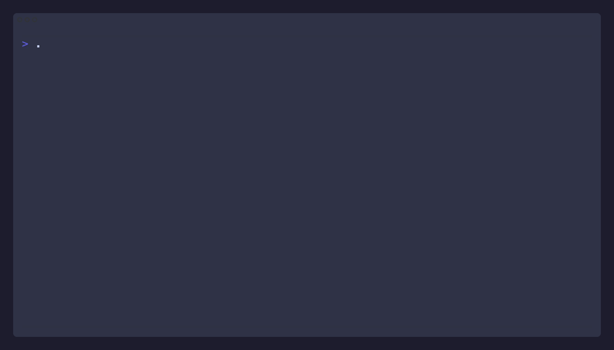
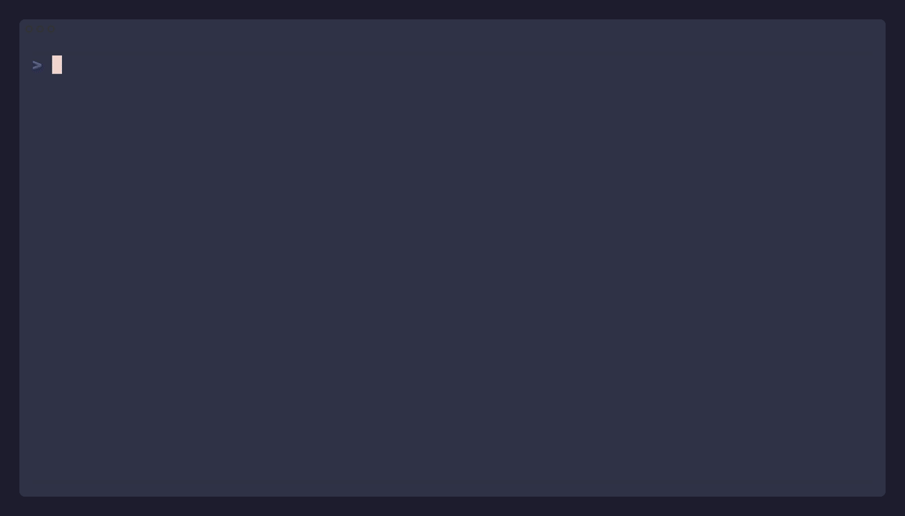

# godaddy-cname

| Adding a subdomain | Removing a subdomain |
|-------------------|----------------------|
|  |  |

Manage GoDaddy DNS records (CNAME, TXT) from the terminal.

A bash reimplementation of [tui-godaddy-cname](https://github.com/doohinkus/tui-godaddy).

## Usage

# Bash / \*nix environment - see Requirements

```bash
chmod +x godaddy-cname.sh
./godaddy-cname.sh
```

Or copy the example env file and edit with your credentials:

```bash
cp .example.env .env
# edit .env with your GoDaddy API key and secret
```

# Docker (no \ \*nix required)

```bash
# Build
docker build -t godaddy-cname .

# Run with .env mounted
docker run -it --rm -v "$PWD/.env:/app/.env" godaddy-cname
```

## Configuration

### Single account (`.env`)

Create a `.env` file in the script directory:

| Variable             | Description        | Default                   |
| -------------------- | ------------------ | ------------------------- |
| `GODADDY_API_KEY`    | GoDaddy API key    | —                         |
| `GODADDY_API_SECRET` | GoDaddy API secret | —                         |
| `GODADDY_BASE_URL`   | API base URL       | `https://api.godaddy.com` |

Get credentials at: https://developer.godaddy.com/keys

**OTE/testing:** Set `GODADDY_BASE_URL=https://api.ote-godaddy.com`

### Multiple accounts (profiles)

Create individual `.env` files under `profiles/`:

```bash
mkdir -p profiles
cat > profiles/production.env << 'EOF'
GODADDY_API_KEY=your_prod_key
GODADDY_API_SECRET=your_prod_secret
EOF

cat > profiles/ote.env << 'EOF'
GODADDY_API_KEY=your_ote_key
GODADDY_API_SECRET=your_ote_secret
GODADDY_BASE_URL=https://api.ote-godaddy.com
EOF
```

When 2+ profiles exist, a selection menu appears at startup. With 1 profile it's auto-selected. With 0 profiles, the script falls back to `.env` + interactive prompt (backward compatible).

## Features

- List domains — pick one from a numbered menu
- Record type toggle (`t` key) — switch between CNAME and TXT records
- View records — table with name, data/value, TTL
- Add records — prompted for name, value, TTL
- Edit records — pre-filled prompts, PATCH to update
- Delete records — confirmation prompt, GET+PUT filter removal
- Multi-profile credentials — switch between API accounts
- Profile name displayed in all headers
- All API errors displayed inline with GoDaddy error messages

## Project Structure

```text
godaddy-cname.sh          # Main entry point (orchestrates TUI flow)
lib/
├── json.sh               # JSON parsing helpers (jq + grep/sed fallback)
├── api.sh                # GoDaddy API communication (GET, PATCH, PUT)
├── ui.sh                 # Terminal UI helpers (colors, prompts, menus)
└── credentials.sh        # API credential management (.env + profiles + interactive)
profiles/                 # Profile .env files (gitignored)
```

## Requirements

- Docker (recommended — works on any OS), **or**
- bash 3+
- curl
- jq (optional — falls back to grep/sed for JSON parsing)

## API

Uses the [GoDaddy REST API](https://developer.godaddy.com/doc/endpoint/domains):

| Operation         | Method    | Endpoint                                |
| ----------------- | --------- | --------------------------------------- |
| List domains      | GET       | `/v1/domains`                           |
| Get records       | GET       | `/v1/domains/{domain}/records/{type}`   |
| Add/update record | PATCH     | `/v1/domains/{domain}/records`          |
| Delete record     | GET + PUT | GET all records of type, filter, PUT replacement |

The record type (`CNAME` or `TXT`) is controlled by the `t` key toggle in the TUI.
